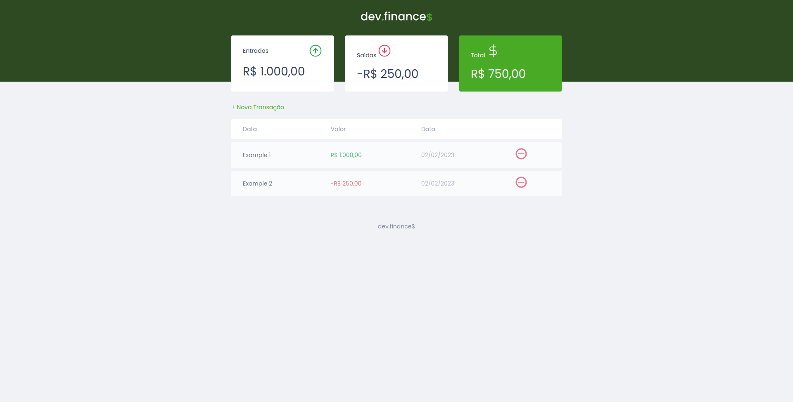
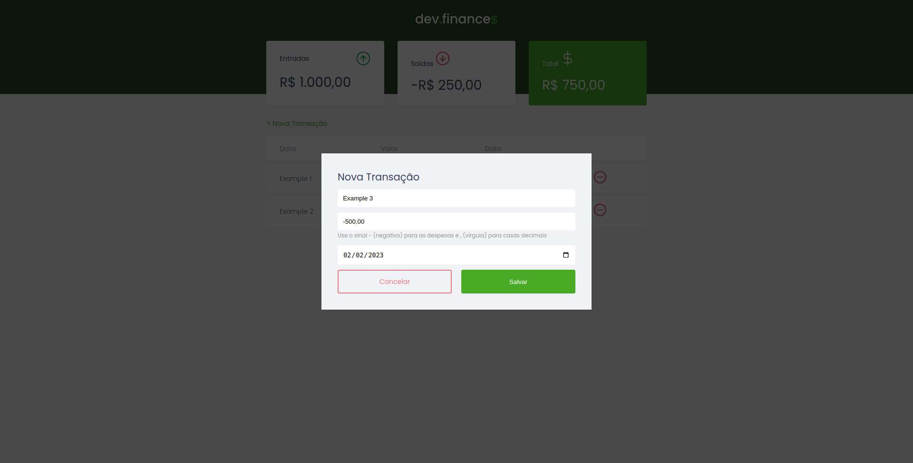
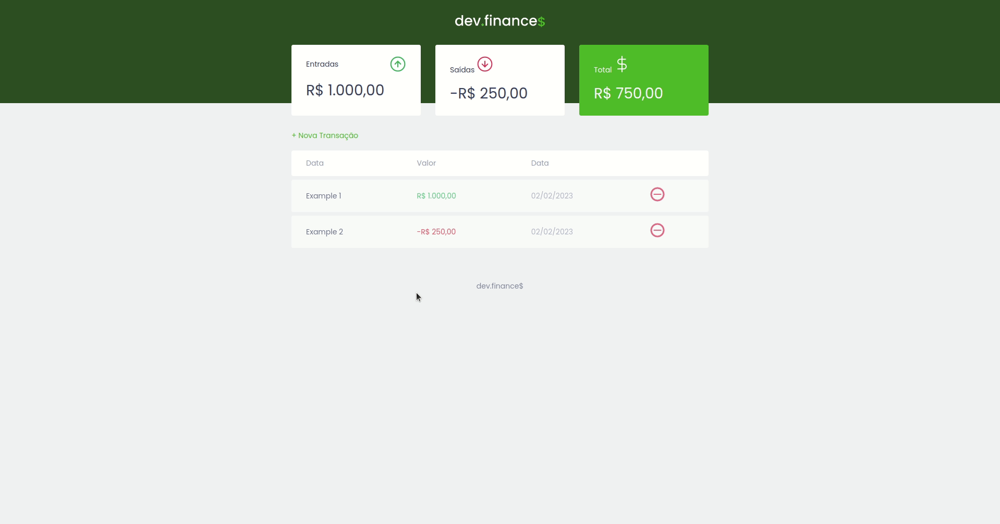

<p align="center">
  
  <br>
</p>
<h3 align="center">
Você no controle das suas finanças!
</h3>

<p align="center">
  
  
  
  
</p>

<p align="center">
  <a href="#sobre">Sobre</a> •
  <a href="#dev-finance">Dev Finance</a> •
  <a href="#instalação">Instalação</a> •
  <a href="#tecnologias">Tecnologias</a> •
  <a href="#autor">Autor</a>  
</p>

## Sobre

Projeto criado com o intuito de criar uma aplicação básica utilizando a tríade base da web: HTML, CSS Javascript.

## Dev Finance

O Dev Finance é uma aplicação simples para controle financeiro construída com HTML, CSS Javascript.

A aplicação é extremamente simples mas atende ao objetivo de servir como um painel centralizado de controle de gastos. O usuário da aplicação registra através da página web toda a movimentação monetária que desejar e tudo será salvo para ele permanentemente em seu navegador e todo o balanço financeiro é calculado e exibido para ele, conforme ilustrado a seguir:



O registro das movimentações, seja ela de entrada ou saída, é feito através do modal abaixo que é exibido após o clique no botão `+ Nova transação` exibido logo abaixo dos cards de balanço:



Para demonstrar a aplicação, deixo abaixo um GIF onde navego pela aplicação e realizo algumas movimentações:



## Instalação

Antes de começar, você vai precisar ter instalado em sua máquina as seguintes ferramentas:
[Git](https://git-scm.com) e algum navegador moderno de sua preferencia. Além disso é bom ter um editor para trabalhar com o código como [VSCode](https://code.visualstudio.com/).

### 🖥️ Rodando o Front End (Web)

```bash
# Clone este repositório
$ git clone git@github.com:MrRioja/dev-finance.git

# Acesse a pasta do projeto no terminal/cmd
$ cd dev-finance

# Feito isso, basta abrir o arquivo index.html em um navegador de sua preferencia
```

## Tecnologias


<br><br><br>

## Autor

<div align="center">

<h1>Luiz Rioja</h1>
<strong>Backend Developer</strong>
<br/>
<br/>

<a href="https://linkedin.com/in/luizrioja" target="_blank">

</a>

<a href="https://github.com/mrrioja" target="_blank">

</a>

<a href="mailto:lulyrioja@gmail.com?subject=Fala%20Dev" target="_blank">

</a>

<a href="https://api.whatsapp.com/send?phone=5511933572652" target="_blank">

</a>

<a href="https://join.skype.com/invite/tvBbOq03j5Uu" target="_blank">

</a>

<br/>
<br/>
</div>
